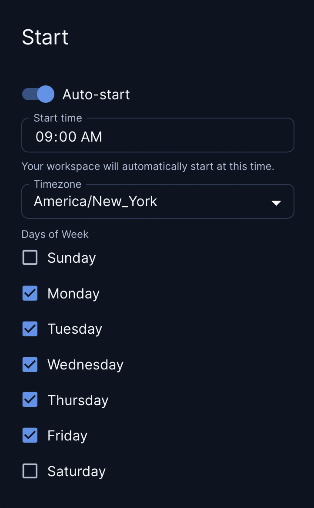
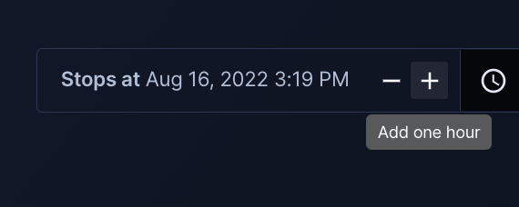

# Workspaces

Workspaces contain the IDEs, dependencies, and configuration information needed
for software development.

## Create workspaces

Each Coder user has their own workspaces created from [shared
templates](./templates.md):

```sh
# create a workspace from the template; specify any variables
coder create --template="<templateName>" <workspaceName>

# show the resources behind the workspace and how to connect
coder show <workspace-name>
```

## IDEs

Coder [supports multiple IDEs](ides.md) for use with your workspaces.

## Workspace lifecycle

Workspaces in Coder are started and stopped, often based on whether there was
any activity or if there was a [template
update](./templates.md#manage-templates) available.

Resources are often destroyed and re-created when a workspace is restarted,
though the exact behavior depends on the template's definitions. For more
information, see [persistent and ephemeral
resources](./templates.md#persistent-and-ephemeral-resources).

> ⚠️ To avoid data loss, refer to your template documentation for information on
> where to store files, install software, etc., so that they persist. Default
> templates are documented in [../examples/templates](https://github.com/coder/coder/tree/c6b1daabc5a7aa67bfbb6c89966d728919ba7f80/examples/templates).
>
> You can use `coder show <workspace-name>` to see which resources are
> persistent and which are ephemeral.

When a workspace is deleted, all of the workspace's resources are deleted.

## Workspace Schedule

You can set a schedule for you workspace to automatically start at a given time (e.g. Monday - Friday at 9 AM).



You can also set a "time until shutdown" to auto-stop your workspace (e.g "8" hours after stopped).


In order to use your workspace past the "time until shutdown," you can use bumpers in the dashboard to keep the workspace alive:



### Activity detection (alpha)

To keep your workspace running past the "time until shutdown," Coder can bump the workspace lifetime by 1 hour when it detects any of the following activities:

- Open tunnel (SSH connection)

  If you have an open tunnel/SSH connection, the CLI will send keepalives to Coder, even if you are not typing.

  Use `coder tunnel --disable-keep-alive` or `coder config-ssh --disable-keep-alive` to avoid send keepalives to Coder.

- HTTP (or websocket) request on `coder_app`

  Coder's proxy will detect any traffic on apps (e.g. code-server)

- Typing in web terminal

- API Request (Manual/custom integrations)

  ```sh
  curl https://coder.example.com/api/v2/workspaces/id/extend
  ```

> To prevent false positives, we are considering using VS Code and JetBrains plugins to detect activity, instead of examining network requests. [Let us know](https://github.com/coder/coder/needs-issue) if this feature interesting is to you.

If a template has a maximum lifetime (e.g. 16 hours), workspaces can no longer be bumped manually or by activity after that time.

> If you are a Coder admin and would like increased visibility and fine-grained controls on auto start/stop, [we'd like to hear from you](https://coder.com/contact)

## Updating workspaces

Use the following command to update a workspace to the latest template version.
The workspace will be stopped and started:

```sh
coder update <workspace-name>
```

## Logging

Coder stores macOS and Linux logs at the following locations:

| Service          | Location                        |
| ---------------- | ------------------------------- |
| `startup_script` | `/tmp/coder-startup-script.log` |
| Agent            | `/tmp/coder-agent.log`          |

---

## Up next

- Learn about how to personalize your workspace with [Dotfiles](./dotfiles.md)
- Learn about using [IDEs](./ides.md)
